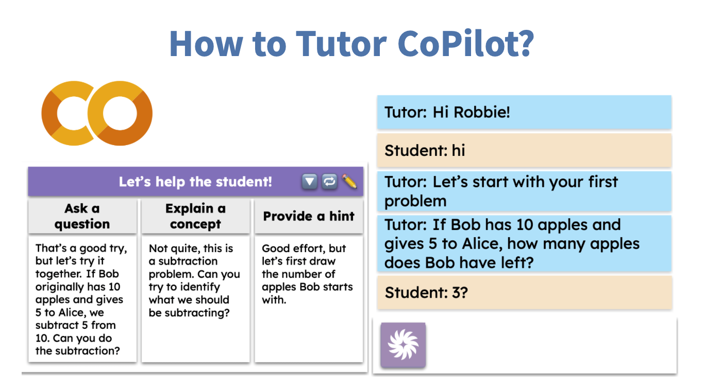

# Tutor CoPilot: A Human-AI Approach for Scaling Real-Time Expertise

**Authors**: Rose E. Wang, Ana T. Ribeiro, Carly D. Robinson, Susanna Loeb, Dora Demszky

**Contact**: rewang@cs.stanford.edu




This repository holds the demo code for Tutor CoPilot tutorial. 
You can find the tutorial video, colab notebook, and the paper in the following links:
<!-- Big hyperlinks -->
## [**Video**](https://youtu.be/vV0jXEs4hdw) | [**Colab**](https://colab.research.google.com/drive/11eZ04vTEAit5bmp3Yl2KHhO3YLoILsd-) | [**Paper**](https://arxiv.org/pdf/2410.03017)


## Abstract

Generative AI, particularly Language Models (LMs), has the potential to transform real-world domains with societal impact, particularly where access to experts is limited. For example, in education, training novice educators with expert guidance is important for effectiveness but expensive, creating significant barriers to improving education quality at scale. This challenge disproportionately harms students from under-served communities, who stand to gain the most from high-quality education. We introduce Tutor CoPilot, a novel Human-AI approach that leverages a model of expert thinking to provide expert-like guidance to tutors as they tutor. This study is the **first randomized controlled trial of a Human-AI system in live tutoring**, involving 900 tutors and 1,800 K-12 students from historically under-served communities. Following a preregistered analysis plan, we find that students working with tutors that have access to Tutor CoPilot are 4 percentage points (p.p.) more likely to master topics (p<0.01). Notably, students of lower-rated tutors experienced the greatest benefit, improving mastery by 9 p.p. We find that Tutor CoPilot costs only $20 per-tutor annually. We analyze 550,000+ messages using classifiers to identify pedagogical strategies, and find that tutors with access to Tutor CoPilot are more likely to use high-quality strategies to foster student understanding (e.g., asking guiding questions) and less likely to give away the answer to the student. Tutor interviews highlight how Tutor CoPilot's guidance helps tutors to respond to student needs, though they flag issues in Tutor CoPilot, such as generating suggestions that are not grade-level appropriate. Altogether, our study of Tutor CoPilot demonstrates how Human-AI systems can scale expertise in real-world domains, bridge gaps in skills and create a future where high-quality education is accessible to all students.


## Citation 

If you find this work useful, please consider citing our paper:

```
@article{wang2024tutor,
  title={Tutor CoPilot: A Human-AI Approach for Scaling Real-Time Expertise},
  author={Wang, Rose E and Ribeiro, Ana T and Robinson, Carly D and Loeb, Susanna and Demszky, Dora},
  journal={arXiv preprint arXiv:2410.03017},
  year={2024}
}
```